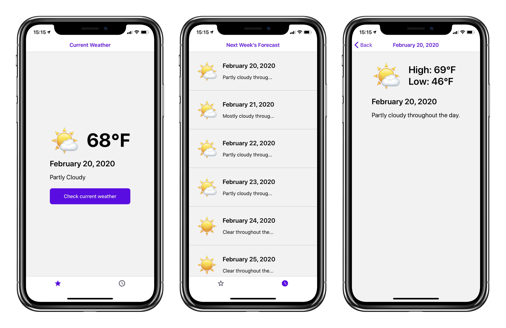

<p align="center">
  
</p>

<h3 align="center" style="font-weight:600">

BrightSky

</h3>

<p align="center">
  Learn how to use Expo with this simple weather app!
</p>

---

<div align="center">

[](https://github.com/expo/expo)
[](https://github.com/expo/expo)
[](https://github.com/expo/expo)

</div>

## Tutorial

This demo will show you how to write a universal app with a single codebase that
runs on iOS, Android, and Web using Expo. We can do this without downloading any new
programs by using our web editor: [snack.expo.io](http://snack.expo.io).

You can follow along by typing/copying code from each successive Snack into your
original snack or by reading through the Snacks that we link as we explain it.

### Introducing Expo's Web Editor - Snack

⭐️ **Start here**: https://snack.expo.io/@fiberjw/3d7120

To start off, we added a minimal static template to this Snack project. Notice that our app is instantly rendered. Since `Web` renders the fastest in Snack, it is the default when working, but you can click on `iOS` or `Android` tab at any time to see your app on a virtual phone or download the Expo Client on your mobile device for the fastest native development experience possible.

### Talking to a Third-party API with React Hooks

Source: https://snack.expo.io/@fiberjw/brightsky-pt.1

We use [React Hooks](https://reactjs.org/docs/hooks-overview.html) to make our app dynamic. There is a lot of stuff written
about Hooks online, but for this app, we are going to only use the two most
common hooks: `useState` and `useEffect`. Let's talk through what is happening
on line 15 to gain an understanding of `useState`:

```jsx
const [currentWeather, setCurrentWeather] = useState({
  currently: {
    summary: "",
    temperature: 0,
    icon: "clear-day"
  }
});
```

We create a new state variable `currentWeather` and a companion "updater" function
`setWeather` which allows us to modify `currentWeather` in a way that propagates
throughout the app. The initial value of `currentWeather` is set by the input to
`useState`:

```jsx
{
  currently: {
    summary: '',
    temperature: 0,
    icon: 'clear-day',
  }
}
```

We see the same pattern being used on line 22:

```jsx
const [loading, setLoading] = useState(true);
```

To make sure you are following along, what is the output of the following
expression?

```jsx
{
  loading ? "not ready" : "ready";
}
```

So, let's trace through how our app renders:

```jsx
<View style={styles.container}>
  {loading ? (
    <ActivityIndicator color={purple} size="large" />
  ) : (
    <View>
      <View style={styles.weatherIconAndTempRow}>
        <Text style={styles.weatherIcon}>
          {getForecastEmoji(currentWeather.currently.icon)}
        </Text>
        <Text style={styles.temp}>
          {Math.round(currentWeather.currently.temperature)}°F
        </Text>
      </View>
      <Text style={styles.date}>
        {dayjs(Date.now()).format("MMMM D, YYYY")}
      </Text>
      <Text style={styles.summary}>{currentWeather.currently.summary}</Text>
    </View>
  )}
  <StatusBar barStyle="dark-content" />
</View>
```

Since `loading === true` we render the spinning disk:

```jsx
<ActivityIndicator color={purple} size="large" />
```

After the render is complete, the second hook `useEffects` comes into play. `useEffect` allows you to run "effects" after the layout has been rendered. In this case our "effect" is a call to an external api:

```jsx
useEffect(function didMount() {
  getWeather();
}, []);
```

We fetch the `currentWeather` and if successful, we update our state variables
`loading` and `currentWeather`. If we are unsuccessful, we submit an error
message.

```jsx
async function getWeather() {
  setLoading(true);
  try {
    const currentWeather = await fetchCurrentWeatherAsync();

    setLoading(false);
    setCurrentWeather(currentWeather);
  } catch (e) {
    console.error(e);
    setLoading(false);
    setCurrentWeather({
      currently: {
        summary:
          "Weather request failed. Please use the button below to try again.",
        temperature: 0,
        icon: "error"
      }
    });
  }
}
```

Setting the state triggers a render. Looking again at line 50:

```jsx
<View style={styles.container}>
  {loading ? (
    <ActivityIndicator color={purple} size="large" />
  ) : (
    <View>
      <View style={styles.weatherIconAndTempRow}>
        <Text style={styles.weatherIcon}>
          {getForecastEmoji(currentWeather.currently.icon)}
        </Text>
        <Text style={styles.temp}>
          {Math.round(currentWeather.currently.temperature)}°F
        </Text>
      </View>
      <Text style={styles.date}>
        {dayjs(Date.now()).format("MMMM D, YYYY")}
      </Text>
      <Text style={styles.summary}>{currentWeather.currently.summary}</Text>
    </View>
  )}
  <StatusBar barStyle="dark-content" />
</View>
```

We finally get our weather forecast.

We've abstracted away most of the interaction with the BrightSky API in our `api.js` file. We will be around for any questions afterwards, but it's worth highlighting one detail: system permissions. System permissions can be a bit lengthy to set up, but are essential. Using the `expo-permissions` module, we eliminate the tedious setup.

### User Interaction

Source: https://snack.expo.io/@fiberjw/brightsky-pt.-2

Let's create a custom button to refetch the current weather!

In our `StyleSheet.create` call, add the following configuration to style our custom button:

```jsx
// StyleSheet.create ...
checkButtonContainer: {
  backgroundColor: purple,
  borderRadius: 8,
  padding: 16,
  alignItems: 'center',
  justifyContent: 'center',
},
checkButtonLabel: { color: 'white', fontSize: 16, fontWeight: '500' },
```

Below the `<Text>` element rendering the current weather summary, add this `TouchableOpacity`:

```jsx
<TouchableOpacity style={styles.checkButtonContainer} onPress={getWeather}>
  <Text style={styles.checkButtonLabel}>Check current weather</Text>
</TouchableOpacity>
```

This button re-runs the `getWeather()` function whenever it is pressed, so users can stay up to date with weather changes.

### Adding Navigation to our App

Source: https://snack.expo.io/@fiberjw/brightsky-pt.-3

Just like most websites have multiple pages, Apps often make use of multiple different "screens". Let's refactor our app to see how to do this.

Let's make a folder called `screens` with three files:

```jsx
// CurrentWeather.js
// 1. copy everything from App.js
// 2. change local imports from ./ to ../
// 3. change "export default function App" to "export function CurrentWeather"
```

```jsx
// DailyForecast.js
import React from "react";
import { Text } from "react-native";

export function DailyForecast() {
  return <Text>DailyForecast</Text>;
}
```

```jsx
// ForecastDetails.js
import React from "react";
import { Text } from "react-native";

export function ForecastDetails() {
  return <Text>ForecastDetails</Text>;
}
```

In our `App.js` file, we can now replace it with a navigator config, powered by
[React Navigation](https://reactnavigation.org/docs/en/4.x/getting-started.html), which will handle screen transitions and create navigation components (headers, tab bars, etc) for us.

```jsx
// App.js
import React from "react";
import { createAppContainer } from "react-navigation";
import {
  createStackNavigator,
  NavigationStackProp
} from "react-navigation-stack";
import {
  createBottomTabNavigator,
  NavigationTabProp
} from "react-navigation-tabs";
import dayjs from "dayjs";
import { MaterialCommunityIcons } from "@expo/vector-icons";

import { CurrentWeather } from "./screens/CurrentWeather";
import { DailyForecast } from "./screens/DailyForecast";
import { ForecastDetails } from "./screens/ForecastDetails";
import { purple, darkGray } from "./colors";

const MainTabNavigator = createBottomTabNavigator(
  {
    CurrentWeather,
    DailyForecast
  },
  {
    initialRouteName: "CurrentWeather",
    defaultNavigationOptions: ({ navigation }) => ({
      tabBarIcon: ({ focused }) => {
        const { routeName } = navigation.state;

        let iconName;
        const color = focused ? purple : darkGray;
        if (routeName === "CurrentWeather") {
          iconName = focused ? "star" : "star-outline";
        } else if (routeName === "DailyForecast") {
          iconName = focused ? "clock" : "clock-outline";
        }

        return (
          <MaterialCommunityIcons name={iconName} color={color} size={24} />
        );
      }
    }),
    tabBarOptions: {
      showLabel: false,
      activeTintColor: purple,
      inactiveTintColor: darkGray
    }
  }
);

MainTabNavigator.navigationOptions = ({
  navigation
}: {
  navigation: NavigationTabProp
}) => {
  const { routeName } = navigation.state.routes[navigation.state.index];

  // You can do whatever you like here to pick the title based on the route name
  let headerTitle;
  if (routeName === "CurrentWeather") {
    headerTitle = "Current Weather";
  } else if (routeName === "DailyForecast") {
    headerTitle = "Next Week's Forecast";
  }

  return {
    headerTitle
  };
};

const AppNavigator = createStackNavigator(
  {
    MainTabNavigator,
    ForecastDetails: {
      screen: ForecastDetails,
      navigationOptions: ({
        navigation
      }: {
        navigation: NavigationStackProp
      }) => ({
        // generate dynamic screen title based on screen's params
        title: dayjs(
          new Date((navigation.state.params || { time: 0 }).time * 1000)
        ).format("MMMM D, YYYY")
      })
    }
  },
  {
    initialRouteName: "MainTabNavigator",
    defaultNavigationOptions: {
      headerTitleStyle: {
        color: purple
      },
      headerBackTitleStyle: {
        color: purple
      },
      headerTintColor: purple
    }
  }
);

export default createAppContainer(AppNavigator);
```

### Rendering a List of Components

Source: https://snack.expo.io/@fiberjw/brightsky-pt.-4

In our `DailyForecast.js` file, copy and paste the following code:

```jsx
// DailyForecast.js
import React, { useEffect, useState } from "react";
import {
  View,
  StatusBar,
  StyleSheet,
  Text,
  TouchableOpacity,
  FlatList,
  ActivityIndicator
} from "react-native";
import { fetchForecastAsync, getForecastEmoji } from "../api";
import { black, purple } from "../colors";
import dayjs from "dayjs";

function ForecastItem({
  time,
  summary,
  icon,
  temperatureHigh,
  temperatureLow,
  navigation
}) {
  return (
    <TouchableOpacity
      onPress={() =>
        navigation.navigate("ForecastDetails", {
          time,
          summary,
          icon,
          temperatureHigh,
          temperatureLow
        })
      }
    >
      <View style={styles.weatherIconAndTempRow}>
        <Text style={styles.weatherIcon}>{getForecastEmoji(icon)}</Text>
        <View>
          <Text style={styles.date}>
            {dayjs(new Date(time * 1000)).format("MMMM D, YYYY")}
          </Text>
          <Text style={styles.summary}>{summary.substr(0, 20)}...</Text>
        </View>
      </View>
    </TouchableOpacity>
  );
}

export function DailyForecast({ navigation }) {
  const [dailyForecast, setDailyForecast] = useState({
    daily: {
      summary: "",
      icon: "clear-day",
      data: []
    }
  });
  const [loading, setLoading] = useState(true);

  async function getForecast() {
    setLoading(true);
    try {
      const dailyForecastResult = await fetchForecastAsync();

      setLoading(false);
      setDailyForecast(dailyForecastResult);
    } catch (e) {
      setLoading(false);
    }
  }

  useEffect(function didMount() {
    getForecast();
  }, []);

  return (
    <View style={styles.container}>
      {loading ? (
        <ActivityIndicator color={purple} size="large" />
      ) : (
        <FlatList
          keyExtractor={item => `${item.time}`}
          data={dailyForecast.daily.data}
          renderItem={({ item }) => (
            <ForecastItem navigation={navigation} {...item} />
          )}
          onRefresh={getForecast}
          refreshing={loading}
          ItemSeparatorComponent={() => <View style={styles.separator} />}
        />
      )}
      <StatusBar barStyle="dark-content" />
    </View>
  );
}

const styles = StyleSheet.create({
  container: {
    flex: 1
  },
  separator: {
    height: StyleSheet.hairlineWidth,
    backgroundColor: black,
    opacity: 0.4
  },
  weatherIcon: {
    fontSize: 64,
    marginRight: 16
  },
  weatherIconAndTempRow: {
    flexDirection: "row",
    alignItems: "center",
    padding: 24
  },
  date: {
    fontSize: 20,
    fontWeight: "600",
    marginBottom: 16
  },
  summary: {
    fontSize: 16
  }
});
```

`DailyForecast` is basically a `FlatList` of `TouchableOpacity`-wrapped components. These are
handy components worth getting comfortable with. For example, you could hack
together a Instagram feed with them.

The `ForecastItem` has a layout similar to what we did with
the `CurrentWeather` screen. It also introduces us to
[`navigation.navigate`](https://reactnavigation.org/docs/en/4.x/navigation-prop.html#navigate---link-to-other-screens)
which React Navigation provides to us to navigate between different screens:

```jsx
onPress={() =>
  navigation.navigate("ForecastDetails", {
    time,
    summary,
    icon,
    temperatureHigh,
    temperatureLow,
  })
}
```

The first argument to `navigation.navigate` is the name of the screen that you want to navigate to. That screen name was configured in `App.js`'s `createStackNavigator` call.

The second argument to `navigation.navigate` is a parameters object which allows you to pass data to the
screen you want to navigate to.

```jsx
<FlatList
  keyExtractor={item => `${item.time}`}
  data={dailyForecast.daily.data}
  renderItem={({ item }) => <ForecastItem navigation={navigation} {...item} />}
  onRefresh={getForecast}
  refreshing={loading}
  ItemSeparatorComponent={() => <View style={styles.separator} />}
/>
```

`FlatList` is basically a smart `for` loop that optimizes your lists to prevent memory issues that actually using a for loop/array map would cause.

### Rendering Data Passed in from Another Screen

Source: https://snack.expo.io/@fiberjw/brightsky-pt.-5

Let's add some code to our third screen, `ForecastDetails`:

```jsx
// ForecastDetails.js
import React from "react";
import { View, StatusBar, StyleSheet, Text } from "react-native";
import dayjs from "dayjs";

import { getForecastEmoji } from "../api";

export function ForecastDetails({ navigation }) {
  const time = navigation.getParam("time");
  const summary = navigation.getParam("summary");
  const icon = navigation.getParam("icon");
  const temperatureHigh = navigation.getParam("temperatureHigh");
  const temperatureLow = navigation.getParam("temperatureLow");

  return (
    <View style={styles.container}>
      <View>
        <View style={styles.weatherIconAndTempRow}>
          <Text style={styles.weatherIcon}>{getForecastEmoji(icon)}</Text>
          <View>
            <Text style={[styles.temp, { marginBottom: 16 }]}>
              High: {Math.round(temperatureHigh)}°F
            </Text>
            <Text style={styles.temp}>Low: {Math.round(temperatureLow)}°F</Text>
          </View>
        </View>
        <Text style={styles.date}>
          {dayjs(new Date(time * 1000)).format("MMMM D, YYYY")}
        </Text>
        <Text style={styles.summary}>{summary}</Text>
      </View>
      <StatusBar barStyle="dark-content" />
    </View>
  );
}

const styles = StyleSheet.create({
  container: {
    flex: 1,
    alignItems: "center",
    padding: 24
  },
  weatherIcon: {
    fontSize: 88,
    marginRight: 24
  },
  temp: {
    fontSize: 31.25,
    fontWeight: "600"
  },
  weatherIconAndTempRow: {
    flexDirection: "row",
    alignItems: "center",
    marginBottom: 16
  },
  date: {
    fontSize: 25,
    fontWeight: "600",
    marginBottom: 16
  },
  summary: {
    fontSize: 20,
    lineHeight: 25
  }
});
```

This code looks a lot simpler than our previous screens, as it doesn't have to
do any hard things like send an API request or render a list of data-driven
components.

We get the values passed to this screen from `DailyForecast` using the
`navigation.getParam(paramName: string)` function:

```jsx
const time = navigation.getParam("time");
const summary = navigation.getParam("summary");
const icon = navigation.getParam("icon");
const temperatureHigh = navigation.getParam("temperatureHigh");
const temperatureLow = navigation.getParam("temperatureLow");
```

Then, we render the data we get similarly to how we have been doing so before:

```jsx
<View>
  <Text style={[styles.temp, { marginBottom: 16 }]}>
    High: {Math.round(temperatureHigh)}°F
  </Text>
  <Text style={styles.temp}>Low: {Math.round(temperatureLow)}°F</Text>
</View>
```

### Fin

Now you have your first Expo application that fetches data from an API, uses
local device permissions, renders a FlatList, and uses common navigation
paradigms!

Feel free click the 'save' button to the top right if you want to extend this project by adding more screens, changing the styles, or gutting out the content completely and replacing it with your own app idea. Thanks for coming!
